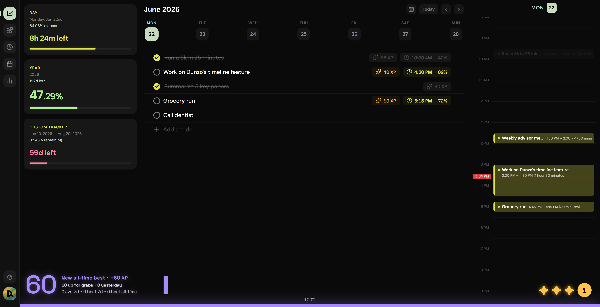
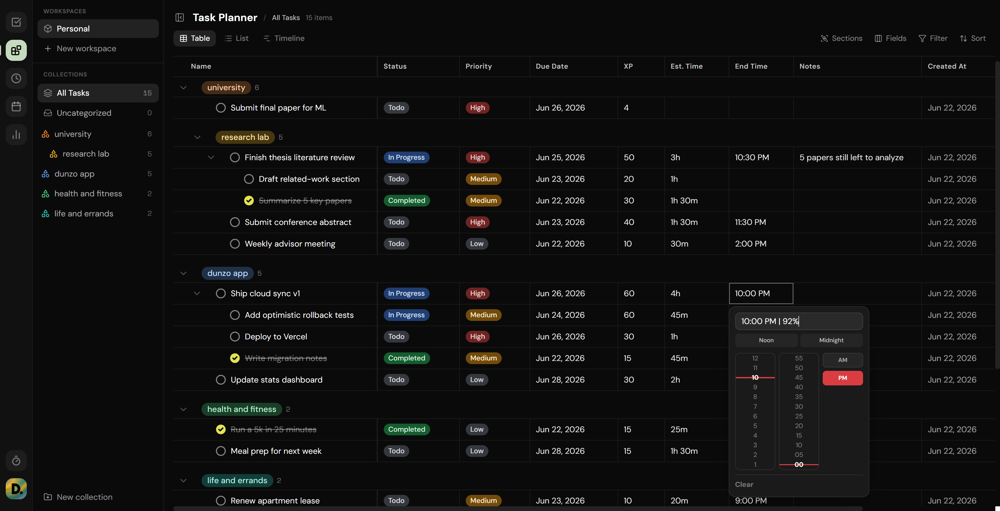
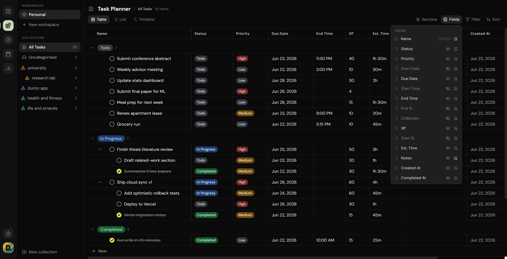
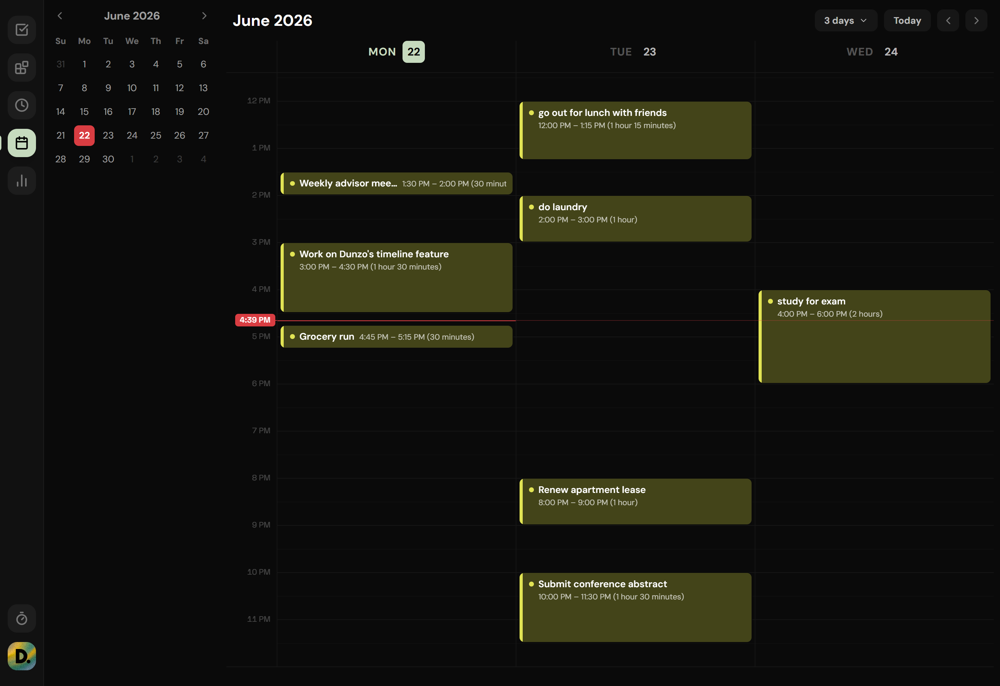
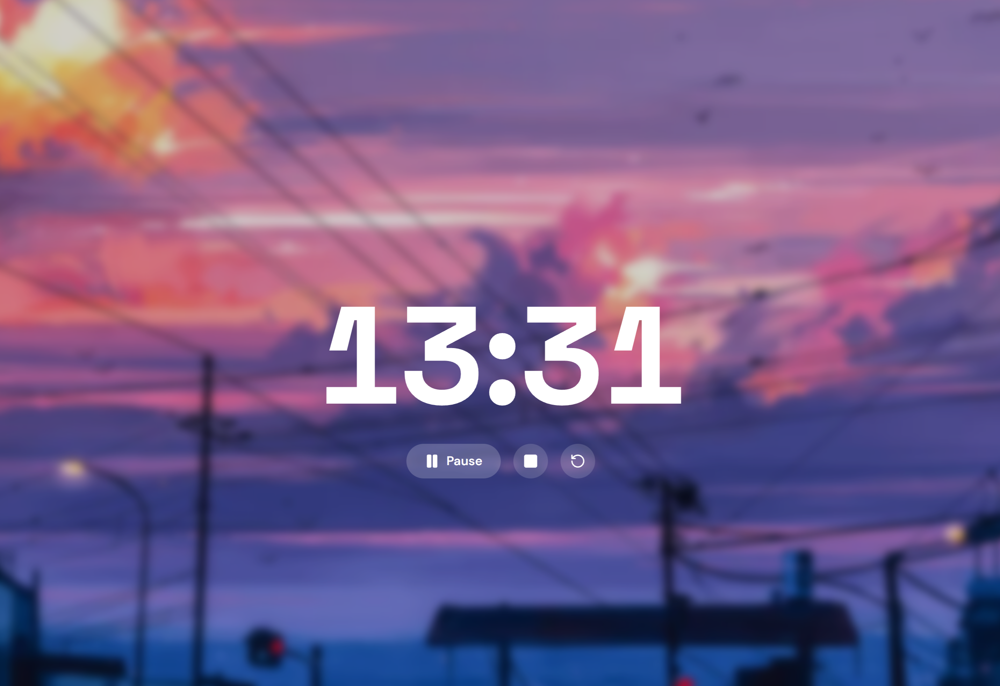
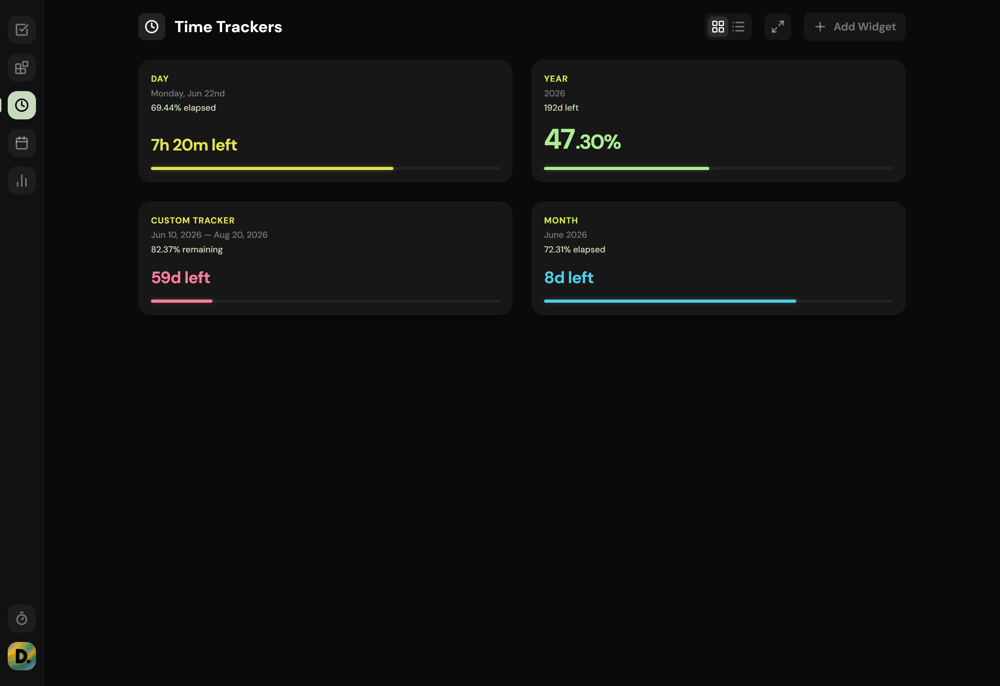
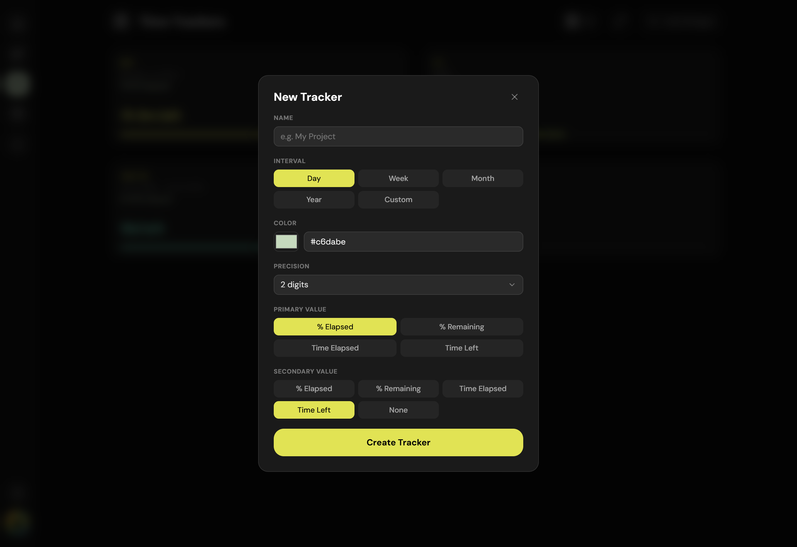
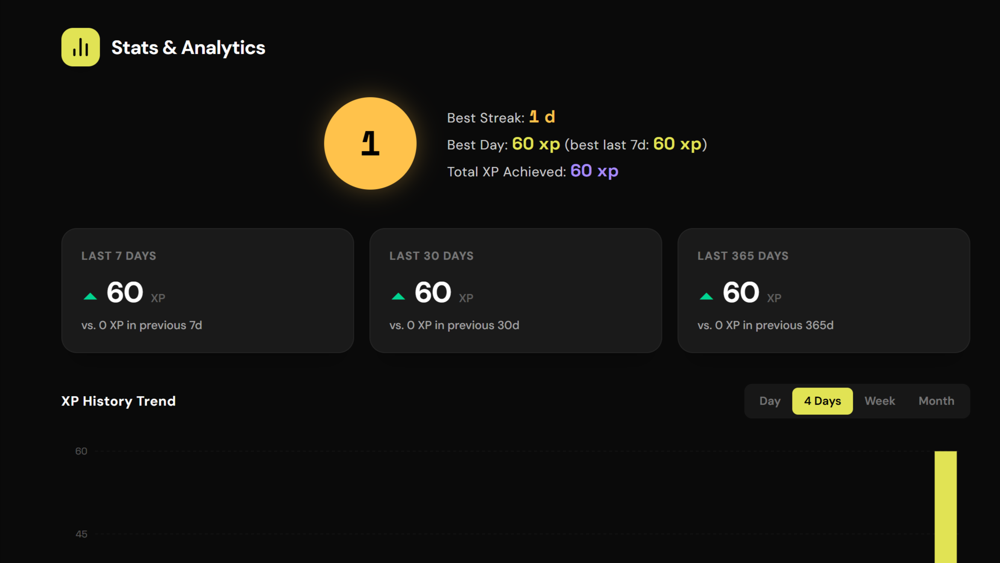
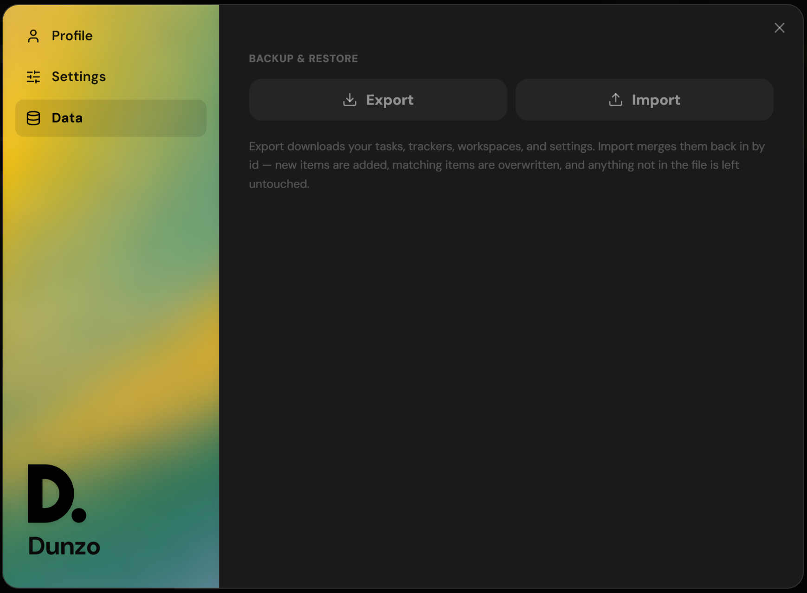
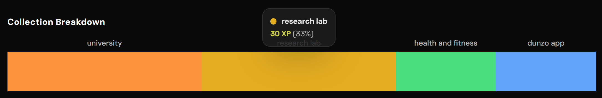

<div align="center">


# Dunzo

### Strategize, plan your day, see your time, and make progress feel like a game.

A full-stack productivity app that combines a **Notion-style task planner**, a focused **daily checklist**, live **time-progress trackers**, and **XP & streak gamification** - all synced to the cloud across your devices.

<br/>

[](https://react.dev)
[](https://www.typescriptlang.org)
[](https://neon.tech)
[](https://tailwindcss.com)

**[🔗 Go to App](https://dunzo-todo.vercel.app/)** · **[Features](#-features)** · **[Screenshots](#-screenshots)** · **[Technical](#technical)**

</div>


## ✨ Why Dunzo?

- 🗂️ **Plan like Notion** - a full table view with nesting, collections, grouping, and drag-and-drop.
- ✅ **Work like a checklist** - a distraction-free daily list for what's due today.
- ⏳ **Stay aware of time** - live widgets showing how much of the day, week, month, or year is left.
- 🎮 **Stay motivated** - XP, daily goals, star ratings, and streaks built from your real history.
- ☁️ **Everywhere you are** - multi-user, cloud-synced, with instant optimistic updates.


## 🎯 Features

### 🗂️ Notion-style Task Planner
A spreadsheet-style table of everything you're planning, with configurable columns (status, priority, urgency, dates, estimated time, XP, notes, collection), inline cell editing, resizable columns, saved views, and filtering & sorting.

- **Unlimited nesting** - subtasks nest to any depth; deleting or archiving a parent cascades to its children.
- **Custom drag-and-drop** - a hand-built engine (no library) lets you **reorder**, **nest**, and **regroup** in one gesture. Drop a task into a *Status* or *Priority* or *Date* group and it takes on that attribute; drop it onto another task and it becomes a subtask.
- **Group by anything** - collection, status, priority, or smart date buckets (Today / Tomorrow / Next 7 Days / …), interactive in every mode.
- **Collections & Workspaces** - organize tasks into nestable collections and split your life into independent workspaces (separate task databases).

### ✅ Daily Checklist
A focused, per-day list of what's due - independent from the planner. A task can live in the planner only, the daily list only, or both, so big-picture planning and day-to-day execution stay separated and focused.

### 📅 Calendar
See your tasks laid out by due date and time across the week.

### ⏳ Time-Progress Trackers
Live widgets that show how much of a **day, week, month, year**, or any **custom date range** has elapsed or remains - with customizable optoins. Includes a stopwatch with a fullscreen focus mode.

### 🎮 XP, Stars & Streaks
Completing tasks earns XP, and Dunzo turns that into motivation:
- **Progressive daily goals** - beat yesterday → beat your best of the last 7 days → beat your all-time best.
- **Star ratings and streak** - earn up to 3 stars a day for showing up, holding your average, and improving. Improvement increases your streak score.

You can also see charts of your XP over time, broken down by collection, so you can see where your effort actually goes.

## 📸 Screenshots

<div align="left">

### Daily Checklist Dashboard


### Task Planner


You can change grouping mode, set filters/sorts, and control field visibility and order:
<br>


NOTE: List View and Timeline View are currently work in progress


### Calendar and Stopwatch



### Time Progress Widgets




### Stats & More




</div>

<div id="technical" align="center">

## 🛠️ Technical

_Everything below is the technical deep-dive: architecture, data model, setup, and API._

</div>

### Tech Stack

| Layer | Technology |
| --- | --- |
| **Frontend** | React 19, TypeScript, Vite 6, Tailwind CSS v4, TanStack Query, Recharts, Motion, lucide-react, date-fns |
| **Backend** | Express, Drizzle ORM, `@neondatabase/serverless`, `jose` (JWT/JWKS) |
| **Database** | Neon (serverless Postgres) |
| **Auth** | Neon Auth (JWT) |

### Architecture

**React 19 SPA (Vite)**

- TanStack Query - caching, optimistic mutations, rollback
- Neon Auth client - session + Bearer token
- `src/data/*` - typed query/mutation hooks (the API seam)

**Express API (server/)**

- `requireAuth` - verifies the Neon Auth JWT against JWKS and sets req.userId
  - every route is scoped by user_id
- `routes/{todos,workspaces,trackers,settings}`
- Transactional batch endpoint for reorder/nest/promote

**Neon Postgres (with Drizzle ORM)**

- Tables: workspaces, todos, trackers, user_settings

**Auth**

The frontend signs in via Neon Auth and attaches a fresh session JWT as a Bearer token on every request (src/data/apiClient.ts). The backend (server/auth.ts) verifies the token against the auth server's JWKS endpoint and enforces issuer/audience, then stamps req.userId. Every data route requires auth and is filtered by user_id, so users can never read or write each other's rows - even the batch upsert guards against cross-user primary-key hijacking.

**Data Layer**

src/data/ wraps the API in TanStack Query hooks. Mutations apply optimistically with a shared snapshot → apply → rollback → invalidate helper, so the UI feels instant and self-heals on error.

**Runtimes**

server/app.ts exports a Express app used both by the local dev server (server/index.ts) and as a serverless function in production.

### Data Model

The core entity is the `Todo` (see [`src/types.ts`](src/types.ts) and [`src/db/schema.ts`](src/db/schema.ts)):

- **Flat list, derived days.** Todos are stored as a flat array; each task owns its scheduled day via `dueDate`. Day-grouped views (daily list, calendar, stats) are derived in memory - there are no per-day buckets in storage.
- **Two visibility flags.** `showInDatabase` controls Task Planner visibility; `showInDailyList` (+ a `dueDate`) controls the daily checklist. They're independent, so a task can appear in one, the other, or both.
- **Self-referential tree.** `parentId` enables unlimited nesting. An `isCollection` node is a folder-like grouping header; a task's collection is its nearest collection ancestor.
- **Status is the source of truth for completion.** `status` (`todo` / `in_progress` / `completed`) drives the derived `completed` column; there is no separate boolean to drift.
- **Per-surface ordering.** `hubOrder` orders tasks in the planner; `dailyOrder` orders them within a single day.

Tables: `workspaces`, `todos`, `trackers`, `user_settings` (one row per user; core prefs as columns, hub layout/view state as JSONB blobs).

### Getting Started

**Prerequisites:** Node.js 18+, and a [Neon](https://neon.tech) Postgres database + Neon Auth project.

```bash
# 1. Install
npm install

# 2. Configure - create a .env in the project root (see below)

# 3. Set up the database
npm run db:push        # push the Drizzle schema to Neon
# or use generated SQL migrations:
# npm run db:generate && npm run db:migrate

# 4. Run (frontend + backend together)
npm run dev
```

`npm run dev` starts Vite (port **3000**) and the Express API (port **8787**) via `concurrently`. Vite proxies `/api` to the backend, so everything is same-origin in dev. Open http://localhost:3000.

### Environment Variables

Have a `.env` in the project root.

**Client** (must be `VITE_`-prefixed to send to browser):

| Variable | Description |
| --- | --- |
| `VITE_NEON_AUTH_URL` | Neon Auth base URL (used by the auth client). |

**Server** (never sent to the browser):

| Variable | Description |
| --- | --- |
| `DATABASE_URL` | Neon Postgres connection string. |
| `NEON_AUTH_URL` | Same value as `VITE_NEON_AUTH_URL`; used server-side for JWKS verification. |

### Scripts

| Script | Description |
| --- | --- |
| `npm run dev` | Run frontend + backend together. |
| `npm run dev:web` / `dev:server` | Run just the frontend / backend. |
| `npm run build` | Production build of the frontend. |
| `npm run preview` | Preview the production build. |
| `npm run lint` | Type-check with `tsc --noEmit`. |
| `npm run db:generate` / `db:migrate` / `db:push` | Drizzle migration workflow. |
| `npm run db:studio` | Open Drizzle Studio. |

### API Reference

All routes are under `/api` and (except health) require a `Bearer` JWT; every query is scoped to the authenticated `user_id`.

| Method | Path | Description |
| --- | --- | --- |
| `GET` | `/api/health` | Liveness check (no auth). |
| `GET` | `/api/me` | Returns the authenticated `userId`. |
| `GET` | `/api/todos` | All of the user's todos. |
| `POST` | `/api/todos` | Create a todo (client-generated id). |
| `PATCH` | `/api/todos/:id` | Partial update. |
| `DELETE` | `/api/todos/:id` | Hard delete (FK cascade removes the subtree). |
| `POST` | `/api/todos/batch` | Transactional `{ upserts, patches, deletes }` - reorder, nesting, collection promote. |
| `GET/POST/PATCH/DELETE` | `/api/workspaces[/:id]` | Workspace CRUD. |
| `GET/POST/PATCH/DELETE` | `/api/trackers[/:id]` | Tracker CRUD. |
| `GET` / `PUT` | `/api/settings` | Read / upsert the user's settings (per-field merge). |

### Project Structure

```
src/
  App.tsx               # Top-level shell, view switching, data-handler wiring
  types.ts              # Core domain types (Todo, Tracker, Workspace, …)
  auth.ts               # Neon Auth client
  components/           # Views and UI (Sidebar, TodoView, CalendarView, StatsView, …)
    todosHub/           # Task Planner: rows, grouping, DnD hooks, view config
  data/                 # TanStack Query hooks + optimistic mutations (the API seam)
  db/schema.ts          # Drizzle schema (shared with the server)
  utils/                # todoFilters, todoStatus, xpUtils, timeUtils
server/
  app.ts                # Express app (no listen - shared by dev + serverless)
  index.ts              # Local dev entry point
  auth.ts               # JWT/JWKS verification, requireAuth
  db.ts                 # Drizzle runtime (Neon serverless pool)
  http.ts               # Shared helpers (asyncHandler, pick, stampCompletion, …)
  routes/               # todos, workspaces, trackers, settings
```
