<div align="center">

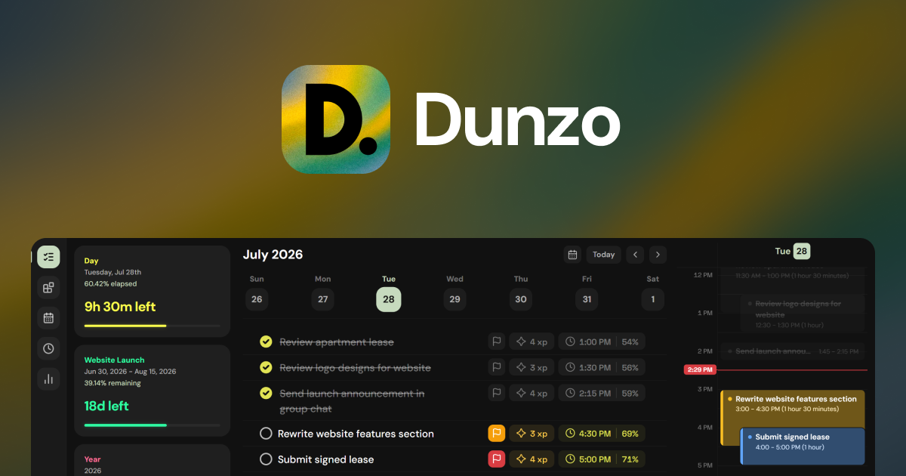

# Dunzo ([dunzo.work](https://dunzo.work/))

### Strategize, plan your day, see your time, and make progress feel like a game.

A full-stack productivity app that combines a **database-style task planner**, a focused **daily checklist**, live **time-progress trackers**, and **XP & streak gamification** - all synced to the cloud across your devices.

<br/>

[](https://react.dev)
[](https://www.typescriptlang.org)
[](https://neon.tech)
[](https://tailwindcss.com)

**[🔗 Go to App](https://dunzo-todo.vercel.app/)** · **[📸 Screenshots](#-screenshots)** · **[🛠️ Technical](#technical)**

</div>


## <a id="features"></a>✨ Why Dunzo?

- 🗂️ **Plan with a database** - a full table view with nesting, collections, grouping, and drag-and-drop.
- ✅ **Work like a checklist** - a distraction-free daily list for what's due today.
- ⏳ **Stay aware of time** - live widgets showing how much of the day, week, month, or year is left.
- 🎮 **Stay motivated** - XP, daily goals, star ratings, and streaks built from your real history.
- ☁️ **Everywhere you are** - multi-user, cloud-synced, with instant optimistic updates.


## 📸 Screenshots

<div align="left">

### Daily Checklist Dashboard
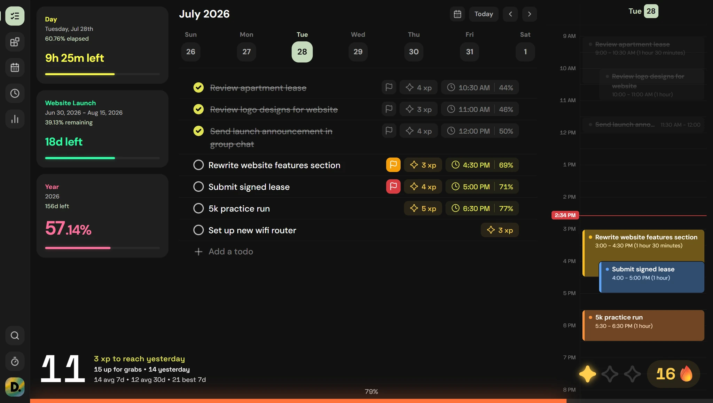

### Task Planner
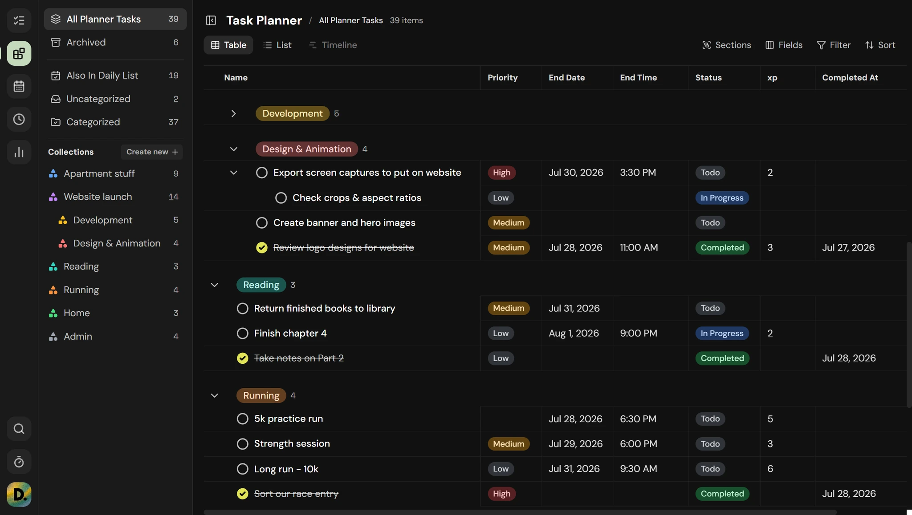

You can change grouping mode, set filters/sorts, and control field visibility and order:
<br>
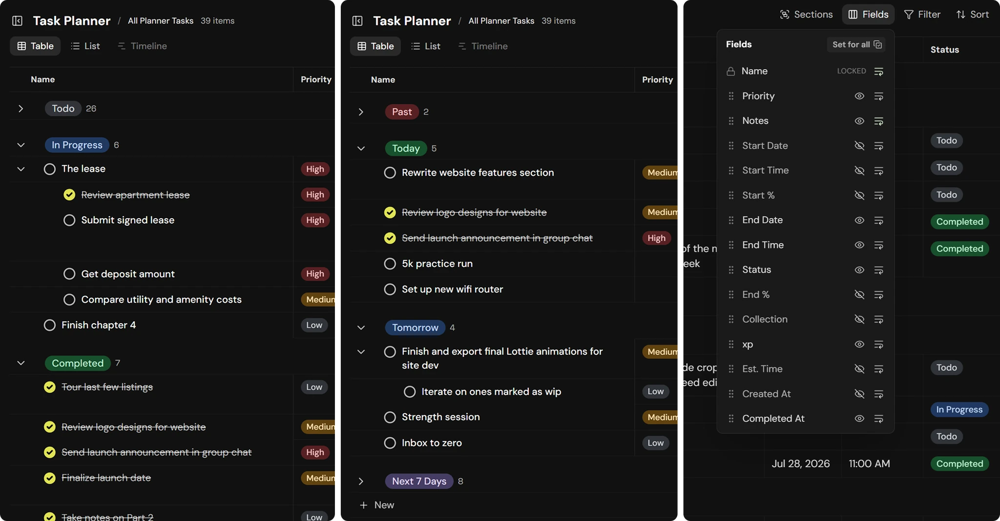

NOTE: Timeline View is currently work in progress


### Calendar
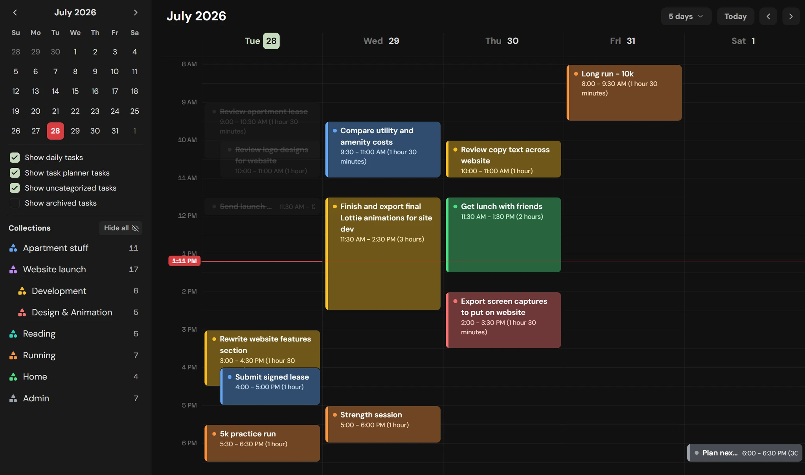

### Time Widgets and Stopwatch/Pomodoro
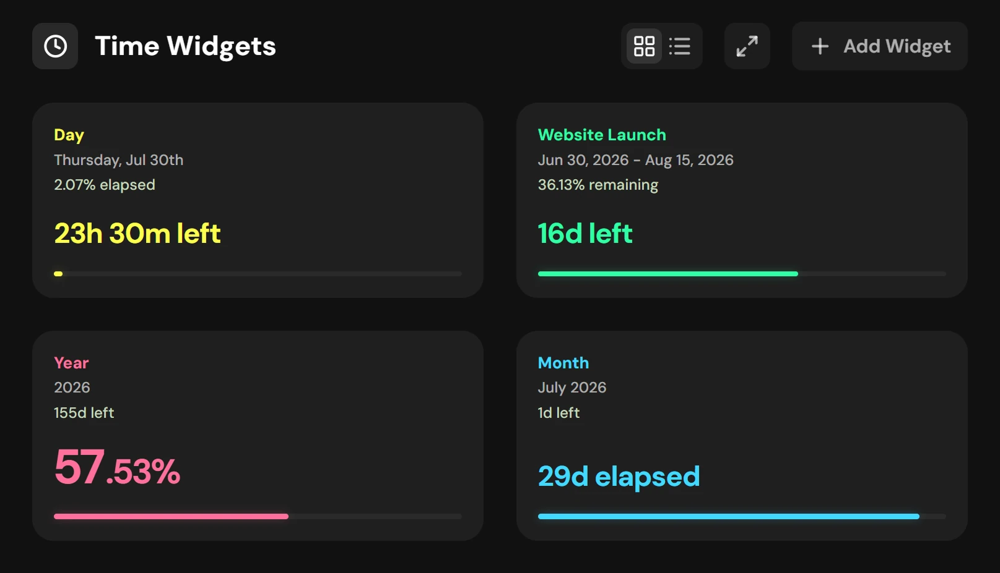
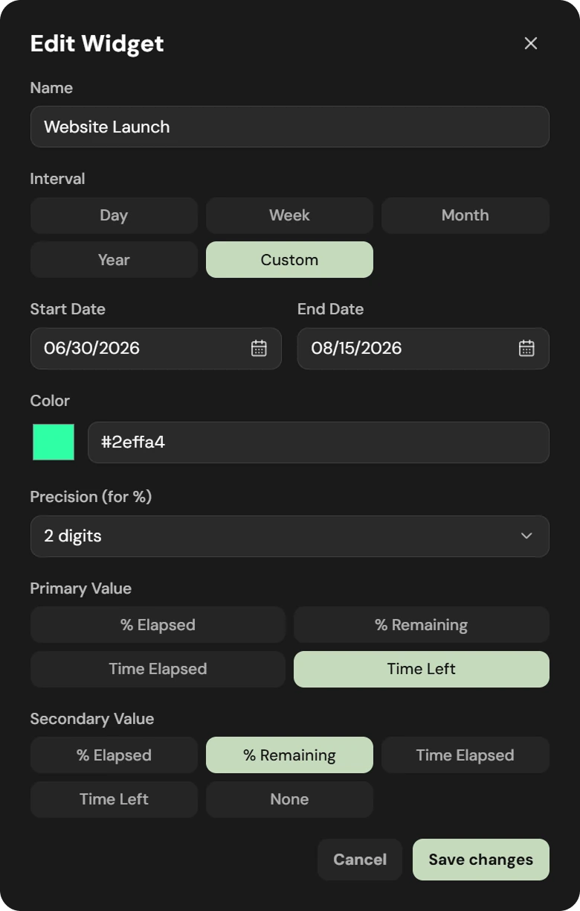
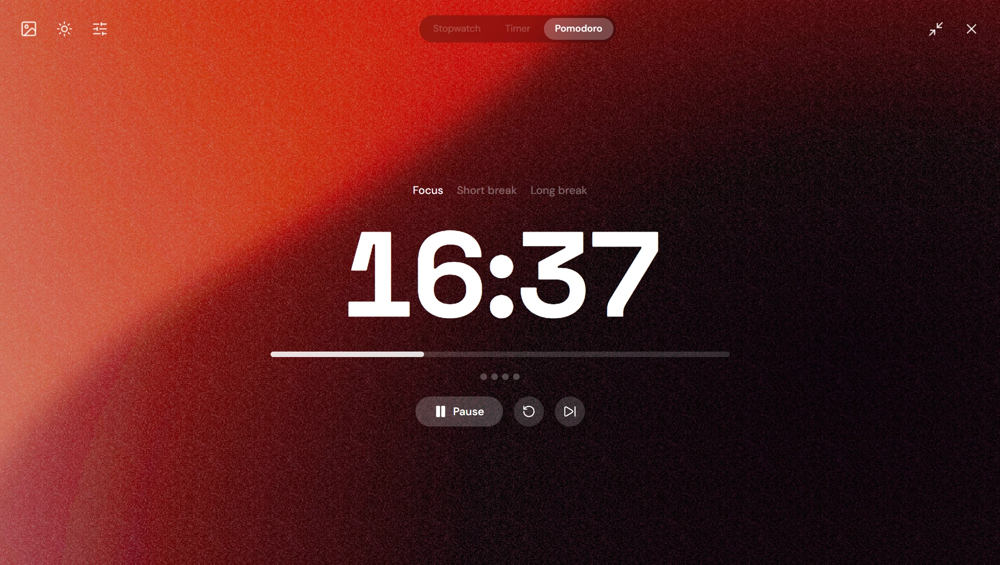
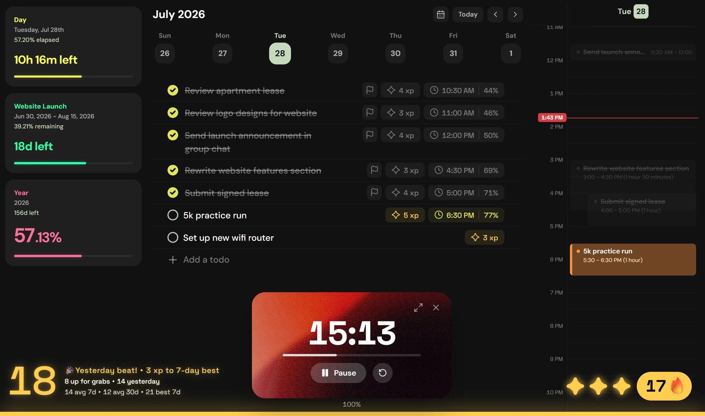


### Stats & More
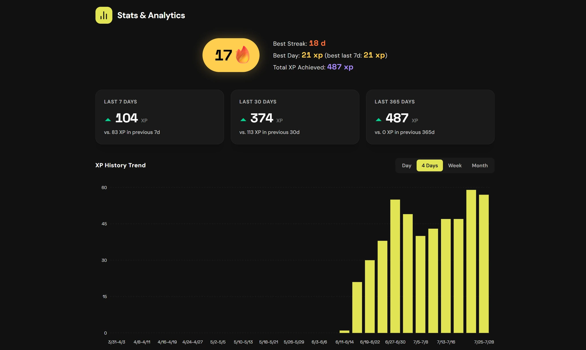
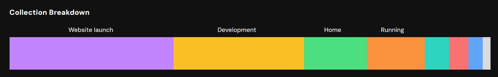
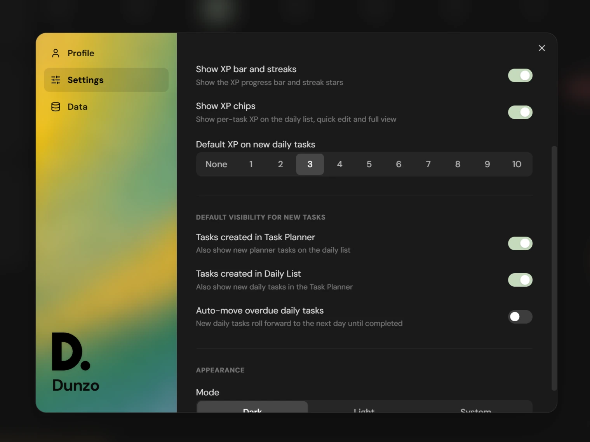

</div>

## 🎯 For detailed features, see [[dunzo.work/features] ](https://dunzo.work/features)


<div id="technical" align="center">

## 🛠️ Technical

_Everything below is the technical deep-dive: architecture, data model, setup, and API._

</div>

### Tech Stack

| Layer | Technology |
| --- | --- |
| **Frontend** | React 19, TypeScript, Vite 6, Tailwind CSS v4, TanStack Query, Tanstack Router, Recharts, Motion, lucide-react, date-fns |
| **Backend** | Express, Drizzle ORM, `@neondatabase/serverless`, `jose` (JWT/JWKS) |
| **Database** | Neon (serverless Postgres) |
| **Auth** | Neon Auth (JWT) |

### Getting Started

**Prerequisites:** Node.js 18+, and a [Neon](https://neon.tech) Postgres database + Neon Auth project.

```bash
# 1. Install
npm install

# 2. Configure - create a .env in the project root (see below)

# 3. Set up the database
npm run db:push        # push the Drizzle schema to Neon
# or use generated SQL migrations:
# npm run db:generate && npm run db:migrate

# 4. Run (frontend + backend together)
npm run dev
npm run dev:landing (for landing page website)
```

`npm run dev` starts Vite (port **3000**) and the Express API (port **8787**) via `concurrently`. Vite proxies `/api` to the backend, so everything is same-origin in dev. Open http://localhost:3000.

### Environment Variables

Have a `.env` in the project root.

**Client** (must be `VITE_`-prefixed to send to browser):

| Variable | Description |
| --- | --- |
| `VITE_NEON_AUTH_URL` | Neon Auth base URL (used by the auth client). |

**Server** (never sent to the browser):

| Variable | Description |
| --- | --- |
| `DATABASE_URL` | Neon Postgres connection string. |
| `NEON_AUTH_URL` | Same value as `VITE_NEON_AUTH_URL`; used server-side for JWKS verification. |

### Scripts

| Script | Description |
| --- | --- |
| `npm run dev` | Run frontend + backend together. |
| `npm run dev:web` / `dev:server` | Run just the frontend / backend. |
| `npm run dev:landing` | Run landing page website. |
| `npm run build` | Production build of the frontend. |
| `npm run preview` | Preview the production build. |
| `npm run lint` | Type-check with `tsc --noEmit`. |
| `npm run db:generate` / `db:migrate` / `db:push` | Drizzle migration workflow. |
| `npm run db:studio` | Open Drizzle Studio. |
