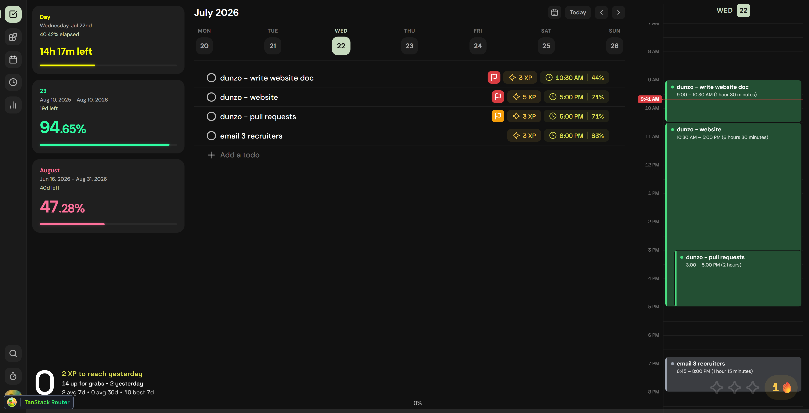

# Dunzo

Design a sleek website for this task management app called Dunzo that will make users want to try it out. In this step there must be no coding, it will be a design and brainstorming session. You will produce a markdown doc outlining the the website in detail: all the pages, the routes, + the content, layout, and design of each page.

I am going to write about the different pages and features of the app - use this as a reference for the website.

## Daily Lists Page

- The daily lists page. The main feature of this app is the middle section (daily task list) and the xp system at the bottom. The tracker widgets on the left and the calendar on the right will be explained later. Here are the features of the daily lists and the XP system:

Daily List:

List shows priority flag, xp, and time chip.

- Click the circle to complete a task. This grays is out.
- Select date to go to that day’s list. Left and Right buttons go to previous/next weeks. Today jumps to today and current week. Calendar button brings up the calendar component below to pick custom date

#### (Calendar Picker Component)

- Note that the text input is smart and takes various formats like “mm/dd/yy” or in word form like “july 12” or “july 14, 2026”.

#### Quick Edit

Clicking add a task brings up Quick Edit Panel on a new untitled task. Clicking on a task to edit it also brings up this same panel, it’s just instead of saying “add a task” it says “save changes”.

The quick edit panel lets you put title, notes, set due date, due time, xp, status, and priority, pick a collection, and set a parent task. These options will be explained more in the Task Features Section.

#### Context

- Hovering on a task shows a grab handle on the left, maximize button, three dots …, and then a delete button on the right.
    - Grab handle allows drag and drop to reorder tasks.
    - Click maximize to open the task in Full View (a window that opens overlayed on the app, very similar to taskist’s task window, or Notion’s center peek mode). This will be explained more later (see task Full View).

- Right clicking on a task or clicking the (…) opens a context menu:

- Many of these do the same thing as the chips in quick edit (date, time, set parent).

#### One Day Calendar

The one day calendar shown on the right of the daily page is a 1 day version of the main calendar. Creating a task here creates it with the daily list task defaults. Tasks are colored by collection. 

## Task Full View and Task Features

- This is aforementioned task full view. Opening in full view shows a window with all task options.
- On the left section is name of task and any notes.
- Archive button marks the task as “Archived” and Delete deletes it.
    - Note that Archived tasks STILL APPEAR in daily lists as long as the Daily Tasks visibility flag is on. Archive impacts where the task shows in Task Planner, and hides it from search.
- Other task features are listed below.

### Status and Priority

- Can be Todo, In Progress, or Completed (checking a task off makes its status completed, and making the status completed marks the check). Can also be empty if cleared, but by default all new tasks are Todo.
- Priority can be Low Medium High (or empty). By default is empty.

### Start and Due Dates

- Clicking the start or due date brings up the date picker component (pretty much same as the one shown earlier). Note that the due date picker shows an extra option (Move forward if overdue).

- If “Move forward if overdue” is true, then that task’s due date will automatically be updated to today once its due date passes. In other words it will keep showing up in the daily list under the current date until it’s completed (or until the move forward if overdue option gets turned off).
- Note that a start/due date is required to have a start/due time. If there is no date, the corresponding time chip is grayed out.

#### (Time Picker Component)

- This is the time picker component used to set time (also used in other parts of the app). The text input for the time picker is also intelligent, and parses various formats like “3p”, “2:45 am”, etc. It can even take a percentage like 33% (percentage of the day that has elapsed, so 33 would be 8 am).

### XP

- Clicking on the XP chip in full view or quick edit brings up xp picker. By default a task is 1 xp (this default can be changed by the user in settings, if changed all new tasks would use the user set default). XP for a task can be empty, or 1 through 5.

### Show In Visibility Flags

The show in Task Planner and show in Daily Tasks flags are visibility flags that will make more sense later. These are by default both set to true (this default can be changed in settings, if changed all new tasks would use the user set default). Basically these control if a task should appear in the Daily Lists page or the Task Planner page or both. Task Planner will be explained later.

### Collection and Parent Task

Collections are folders for tasks. Collections can be nested within each other, and tasks nest under collections. By default a task has no collection. Clicking on the collection chip in task full view or quick edit brings up the collection picker (see below). The collection picker allows searching for and picking a collection (or no collection if desired). Typing in a new collection name allows you to create a new collection and set it as the collection.

Collection Picker

Clicking the Set Parent Task button brings up the Task Finder (will be explained more later). The Task Finder allows searching for and picking a task. This task becomes the calling task’s parent. 

- Note that if the task has a collection, and the parent task has a different collection, the collection of the child task will be changed to the parent’s. Collections/tasks/subtasks have a hierarchical relationship.

What it looks like to have parent task and collection set in the bottom left corner:

## XP, Streaks, and Stats System

Earlier, the daily tasks page had an XP bar and streaks system at the bottom. Here’s how that works:

#### XP Bar

- Completing a task earns you that XP.
- The first XP target for each day is to **match or beat** *yesterday’s* XP earned. Earning XP fills up the bottom bar, relative to that first target.

- Meeting yesterday’s xp fills the bar fully and turns the xp section Gold. Meeting your 7 day best turns it purple.

- The text at the top also changes, at first it says “_ to beat yesterday”. If you beat yesterday, then it says “Ahead of yesterday - _ to 7 day best” and if you beat that it says “_ to all time best”

### Stars and Streak

- You can earn 3 stars in the following way:
    - 1 star for completing any one task
    - 1 star for beating or matching yesterday’s XP (that first target) (0 xp doesn’t count)
    - 1 star for beating or matching your 7d/30d average (0 xp doesn’t count)
- Getting 2 stars allows you hold your streak (streak doesn’t go up, but doesn’t reset).
- Getting 3 stars increases your streak by 1.

### Stats Page

The Stats page is its own page and it shows XP and streak related stats. See image. The yellow badge with the 🔥 emoji is the current streak. Below that are XP summaries for the week/month/year, and a history chart. Below that is a breakdown of the XP earned in the last 30 days by collection. Finally, there’s a log of tasks (with XP greater than 0) and an option to export that log as csv.

Note that the XP system only uses tasks that have the “show in daily list” flag. Meaning only daily list tasks count towards a task. A task that’s only in the task planner won’t count towards XP if it’s completed without being added to daily lists.  

## Task Planner

The task planner is the 2nd main page of the app. It’s a centralized to plan projects and has more complex task features and views. The idea is that you plan tasks here, like a strategic planning board. The daily list is like a focused dashboard to see what you need to get done on a day. Tasks by default are flagged to show in both, so creating a task in daily list will show it in planner, and creating a task in planner + setting a due date will show it in daily list for that date. 

- This behavior can be changed in a task by toggling either of the visibility flags, or changing it in settings for all new tasks. In that configuration you can make it so that daily only tasks which are unimportant or not as cohesive and planner tasks which are planned out and more strategic can be kept separate.

### Left Pane

The left sidebar of the task planner first has a list of pseudo-views: 

- All Planner Tasks shows all tasks which are unarchived. All the views except for the “Archived” tab are configured to show unarchived tasks. Only the Archived tab shows archived tasks. Also in Daily List shows planner tasks that have the daily list flag (and it shows tasks that have the flag even if they don’t have a due date, which is technicaly required for the task to actually show up in a daily list). Uncategorized and Categorized shows tasks that have no collection and those that do have any collection, respectively.
- Archived shows tasks which are archived. Note that if a child task is archived and its parent task is unarchived, both parent and child are shown in the Archived tasks page so that organization and hierarchy are kept in tact - however, the Archived child task now no longer appears in other views, whereas the parent does. Archiving a parent task or collection archives the whole subtree (all subtasks).

The collections section shows the list of collections (which can be nested, shown by indentation). At the bottom is a new collection button. Collections in the sidebar can be dragged and dropped to be reordered

- Right clicking on a collection brings up context menu with option to Edit, Create task inside, Create collection inside, Change color, Archive, and Delete.
- Deleting a collection with tasks will show this:
    
    
    
- There’s a new collection at the bottom.
- Creating a collection through either method creates an Untitled collection, opens it in task planner, and brings up the Collection Edit Modal.

#### (Collection Edit Modal)

- Edit name, pick color (from 8 options), and parent collection (brings up same Collection Picker as shown earlier).

### Main Panel

The main panel shows the tasks, by default in Table mode, but there’s also a List mode which hides all the other columns. Timeline mode is in the works but not currently available.

- Section headers are shown with rounded chips like shown, and when collections are nested the headers are indented. The chevron icon can be used to collapse/expand sections and tasks.
- Note that by default sections are collections, in which case the section headers are Collection names. This can be controlled by grouping controls explained in the next section.
- What columns are shown, the order they’re shown in, and filtering is done via view config in the top right.
- Tasks and collections can be drag and dropped to rearrange here too (Hovering shows a grab handle (see the screenshot of editing name below).

For each column, cells can be clicked to bring up a popover editor to edit that value of the task. For example, clicking on a task name or a collection header chip allows you to edit the name. Note that created and completed timestamps can’t be edited.

editing name

Hovering on a task name also shows a (…) which can be clicked to bring up context menu (right clicking also works). See below (Set time is grayed out because a due date is required to set a due time).

Hovering on a section header shows a grab handle on left and a + sign on right to add a task under that section. In collection grouping mode, there’s a also a (…) that brings up the same context menu shown in the sidebar earlier. Clicking on a collection header lets you rename it inline. 

- Example of List mode: The collection “dunzo project” has been clicked on to be renamed.

#### View Config

For each collection and view in the sidebar (listed earlier), you can set view configs (saved locally for that view). View config is in the top right of the Task Planner with the menus for Sections, Fields, Filter, and Sort. 

**Sections Config**

- Auto-archive Completed: auto archives a task when it’s completed. Hides it from the view and sends it to archived, so it’s not found anywhere else like in search.
- Hide empty sections: Empty sections are not shown (the header isn’t shown)
- Hide subcollections: If in collection grouping, and a collection is open from the sidebar, then the subcollections are hidden. So only tasks that are directly under the currently open collection are shown in the view. If the tab that’s open is not a collection but one of the pseudo-views (like all tasks), then this option shows only 1 root level of collections - subcollections under those collections are hidden (so if you have collections like homework, homework > science, the homework > science collection gets hidden).
- Show Ungrouped Tasks: Where tasks that are ungrouped within the the current view should go (by default Top).
- Group by: This controls the grouping of tasks and how sections are shown. By default is Collections, where sections are collections and nested collections shown as indented sections. Can be changed to Status, Priority, or Due Date. For Status, Priority, and Due Date grouping, you can also control the order to be ascending or descending. Note that task membership in a group is determined by the parent-most task that has a value for that grouping mode. For example if grouping is by priority, and a parent task has priority High, that task and all its descendant tasks will be in the High section, even if some child tasks have a different priority.

grouping by status

grouping by priority (see how ungrouped tasks are shown at top)

grouping by date

**Fields Config**

Fields Config lets you pick what columns are shown in table view, their order, and if they should have word wrap or not. Grab handle for reordering, eye icon for enable/disable, and wrap icon for word wrap. These are all the fields that can be shown for a task. Start % and End % refer the start/end time represented as a percent of the day that has elapsed (so 12:00pm is 50%).

**Filter and Sort**

Filter and Sort config.

Each filter is represented as a line with 4 selections: and/or to control how that filter is combined with others + field to filter on + condition (is, is not, contains, greater than, less than) + value to be compared against (shows all values currently in table for that field). 

example filter, and/or not shown but is there in new version of app

Sort: Sort option is applied WITHIN a section and task. Section ordering is controlled by the sections menu as explained earlier.

## Calendar

Calendar page.

- Click and drag to create a new untitled task (automatically brings up task full view to edit). Clicking on an existing task also brings up task full view on that task.
- Drag top or bottom of existing task to change times. Drag task around brid to change time/date.
- Top right of calendar page has option to change how many days are shown (1,3,5,7), button to jump to today, and left/right to go to next set of dates.
- Overlapping tasks are put in different indent lanes as shown. Hovering brings the card to front.

Left Sidebar:

- First is the calendar picker to pick what day is shown in the calendar.
- Below that is visibility controls for what tasks are shown. Show daily tasks and Show task planner tasks first filters whether daily tasks, planner tasks, or both should be shown. Note that if a task has both flags, then it’ll always show under either options.
- Show uncategorized tasks and show archived tasks determine whether uncategorized tasks should be shown and whether archived tasks should be shown. Having the archived tasks on won’t show all archived, it’ll show those tasks that meet the other criteria. Show archived tasks is off by default in calendar, the other options are all on by default.
- The collections section let you pick what collections to show/hide. Clicking a collection toggles it on/off. When off the icon is unfilled and the text is faint, when on the icon is filled and text is bright (all the collections in the image are on). There’s a button to hide all or show all in the top right.
    - Showing/hiding a collection with subcollections shows a prompt for whether it should show/hide subcollections
    - When a new collection is created in task planner, it’s by default ON in in the calendar.

## Time Tracker Widgets

Remember the time tracker widgets that were shown in the left side of the daily page? This is the full page version where you can create new widgets. This page essentially shows the same thing as the list version on the daily page. The only extra features is a new grid mode, full screen widgets mode, and the ability to add widgets.

- Hovering on a widget shows buttons in the top right to edit or delete it.

- When a widget is created or edited, the editor modal shows:

- These are all the widget options:
    - Interval: The timespan the widget tracks. Day, Week, Month, and Year auto repeat. Custom doesn’t repeat, it just goes to 100% and stays there.
    - Color: Custom color (widget title, bar, and primary value use this color)
    - Primary Value: What’s shown in big font above the bar.
    - Secondary Value: Shown in smaller text with the title and timespan above primary value.
    - Time elapsed/left are built to show different things depending on how big the time is. If the time it’s showing is above 24 hours, it shows ( _ days ). If under 24 hours, it’ll say (_ hours _ minutes), and if it’s under 1 hour, it’ll say ( _ minutes _ seconds).

The list of widgets on the daily page is the same list of widgets that are on the widgets page, but they are shown always as a list. Widgets can’t be created from the daily page, but they can be edited/deleted by hovering on the card.

### Task Finder

In the leftmost ribbon sidebar,  there are buttons at the bottom: Task Finder, Stopwatch, and Settings. Task Finder is a global task search palette. Hit Ctrl+K or the button to bring it up. By default it’s in list mode shown below. Clicking on a task opens Task Full View.

Type into search box to search all unarchived tasks (can be in daily list or planner). There’s also a table mode which shows tasks in similar table UI as task planner. The search algorithm searches not just the task name, but also notes, collections, and other fields of a task. It uses fuzzy search similar to VS Code’s search algorithm.

The Task Finder is the same tool that’s used to pick a task for setting parent task explained earlier. In picker mode, clicking on a task in task finder sets that task as the calling task’s parent. In search mode, clicking on a task from task finder opens it in full view. 

## Stopwatch

Clicking the stopwatch brings up a stopwatch at the bottom of the screen. This can be maximized to go fullscreen.

- Fullscreen stopwatch. Top left has 2 buttons: change background image (choose from your computer, and a button that brings up the panel shown to dim background and add blur).

## Settings

In the bottom left of the ribbon sidebar is the app logo button. Clicking it shows this menu with settings and logout. Premium currently does nothing (not implemented). Ignore it. The settings button brings up the settings modal:

Settings modal has 3 tabs: Profile, Settings, Data. Profile lets you change email, reset password, and log out. 

**Settings**

- First day of week controls how weeks are shown in daily page. Ignore deadline countdown. Show XP options control if XP is shown in UI. Default XP is for new tasks.
- Visibility section controls whether new tasks created in task planner and daily list should be shown in the other section (basically whether they should get the visibility flag). Note that this option only applies to new tasks. Previous tasks keep whatever visibility flags they had. By default both are on.
- Auto-move tasks sets default for new tasks, whether they should have the “auto-move if overdue” option or not. By default off.
- Appearance is just theme.

Data: Last tab is data, for exporting/importing data.

That’s it, those are all the features currently in the app.